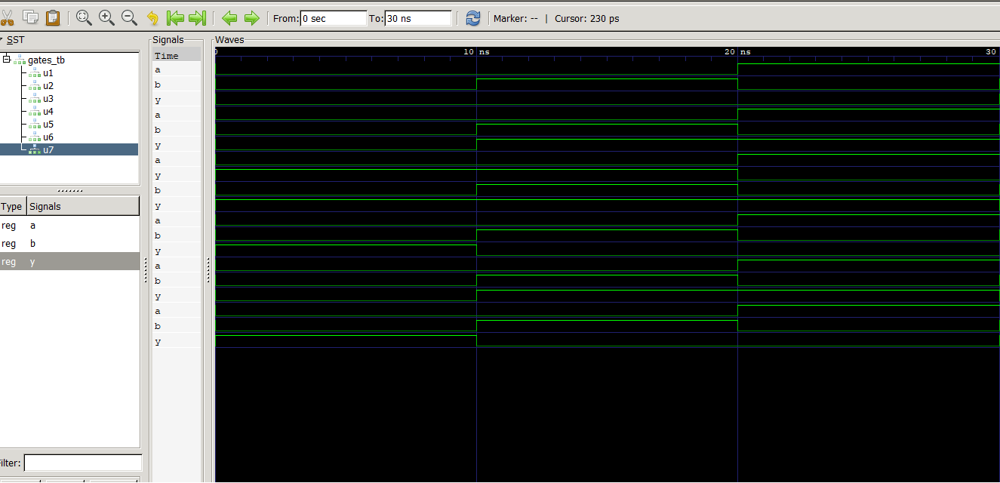

## VHDL Code for Realizing Logic Gates

## Objective
• To write VHDL code for basic logic gates: AND, OR, NOT, NAND, NOR, XOR, and XNOR. • To simulate each gate and verify its truth table using GTKWave.

## Theory
Logic gates are the fundamental building blocks of all digital circuits. Each gate performs a basic Boolean operation on one or more binary inputs to produce a single binary output.

## Gate VHDL Operator Boolean Expression
AND and Y = A · B
OR or Y = A + B
NOT not Y = bar(A)
NAND nand Y = bar(A · B)
NOR nor Y = bar(A + B)
XOR xor Y = bar(A ⊕ B)
XNOR xnor Y = bar(A ⊕ B)

## Output

## Discussion and Conclusion
Therefore, from the output waveform in gtkwave we can see the expected result for all logic gates in the form of signals. The waveforms are displayed for first 10ns as a = b = 0, the next 10ns i.e till 20ns, a = 1, b = 0, the next 30ns i.e. till 30ns a = 0, b = 1, and finally a = b = 1, the result of the logic gates is given below a and b.