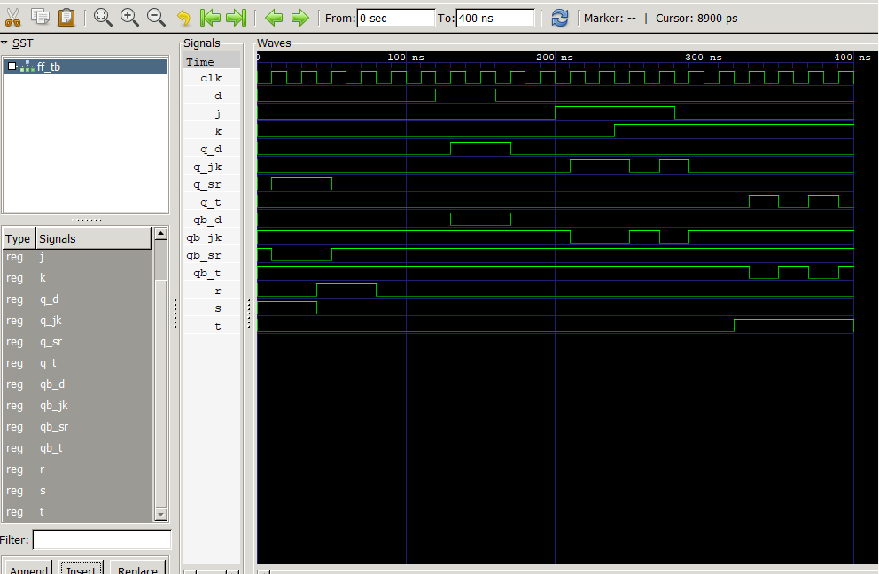

## Lab 7: VHDL Code for Sequential Circuits (Flip-Flops)

## Objective
Design and simulate SR, D, JK, and T flip-flops in VHDL.
Understand clock edge triggering in sequential logic circuits.

## Theory
Flip-flops are bistable memory elements storing one bit of data. Unlike combinational circuits, their outputs depend on current inputs and the previous state, synchronized to a clock edge.

SR: Forms the structural basis but suffers from an invalid state when 
S=1,R=1.
D: Eliminates ambiguity by sampling a single data line, making it perfect for CPU registers.
JK: Resolves the SR invalid state by adding cross-coupled feedback to toggle safely.
T: Efficiently isolates the toggle feature, serving as the core building block for binary counters and clock dividers.
## Truth Tables
# Flip-Flop Truth Tables

## SR Flip-Flop

| S | R | Q(next) | State |
|---|---|---------|-------|
| 0 | 0 | Q | Hold |
| 0 | 1 | 0 | Reset |
| 1 | 0 | 1 | Set |
| 1 | 1 | X | Forbidden |

---

## D Flip-Flop

| D | Q(next) | State |
|---|---------|-------|
| 0 | 0 | Reset |
| 1 | 1 | Set |

---

## JK Flip-Flop

| J | K | Q(next) | State |
|---|---|---------|-------|
| 0 | 0 | Q | Hold |
| 0 | 1 | 0 | Reset |
| 1 | 0 | 1 | Set |
| 1 | 1 | Not Q | Toggle |

---

## T Flip-Flop

| T | Q(next) | State |
|---|---------|-------|
| 0 | Q | Hold |
| 1 | Not Q | Toggle |
## Output

## Discussion
Clock Synchronization: All designs rely on rising_edge(CLK) to update the internal state Q_int, ensuring stable transitions.
State Management: Internal state signals are required to feedback current values for toggling circuits (JK, T) and creating complementary outputs (QB <= not Q_int).
## Conclusion
We successfully designed, compiled, and simulated all four basic flip-flops using behavioral VHDL structures. The simulation verified that edge-triggered sequential logic cleanly isolates stable memory state transitions on precise clock edges.