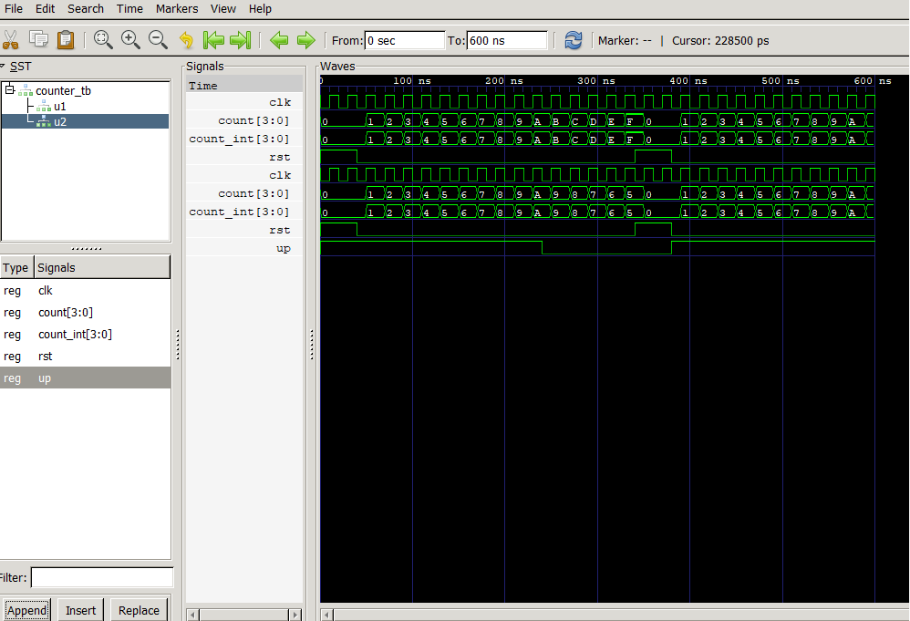

## Lab 8: VHDL Code for Sequential Circuits: Counters

## Objective
To design and simulate a 4-bit synchronous up counter in VHDL.
To design and simulate a 4-bit synchronous up/down counter in VHDL.

## Theory
A counter is a sequential circuit that cycles through a predefined sequence of states on eachclock edge. Counters are built from flip-flops and are fundamental to timing, sequencing, and frequency division.

Synchronous counter: All flip-flops are clocked simultaneously — faster and more reliable than ripple (asynchronous) counters.
Up counter: Increments the count by 1 on each clock edge.
Up/Down counter: Increments or decrements based on a direction control signal.
Reset: An active-high synchronous or asynchronous reset returns the count to zero.
## Output

## Discussion and conclusion
In this laboratory exercise, 4-bit synchronous up and up/down counters were successfully designed, modeled, and analyzed using VHDL behavioral descriptions. Additionally, the lab successfully contrasted asynchronous and synchronous reset patterns, highlighting their distinct impacts on circuit behavior and synchronization.