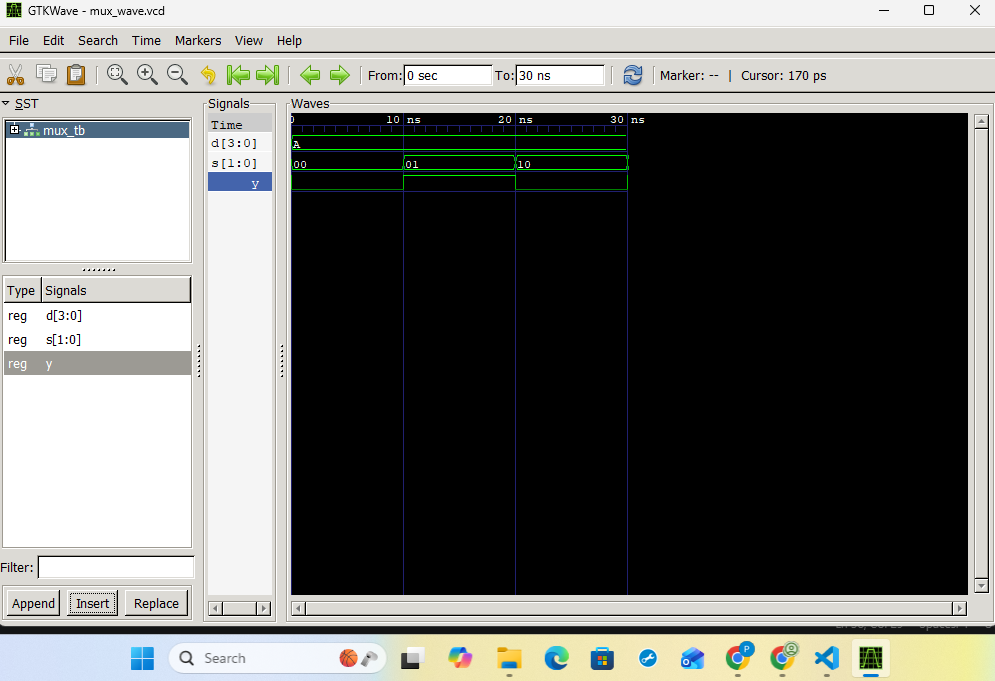
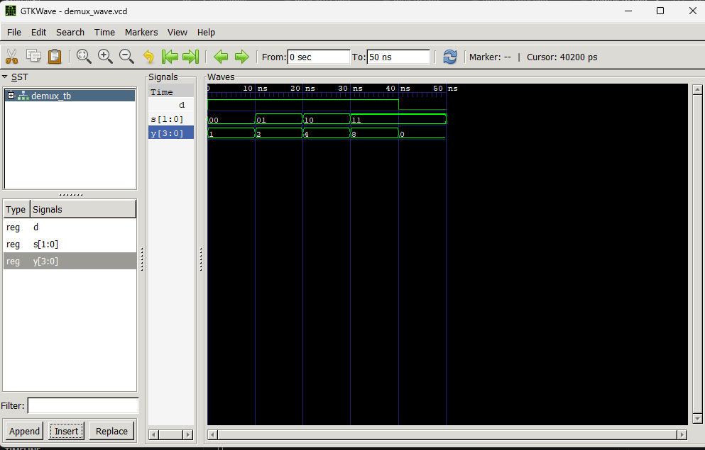

## Lab 4: VHDL Code for Combinational Circuits (MUX and DEMUX)

## Objective

To design and simulate a 4-to-1 Multiplexer (MUX) in VHDL.
To design and simulate a 1-to-4 Demultiplexer (DEMUX) in VHDL.
## Theory

## Multiplexer (MUX) 

A multiplexer selects one of 2^n
 input data lines and routes it to a single output based on nselect lines. A 4-to-1 MUX has 4 data inputs (D0–D3), 2 select lines(S1S0), and 1 output (Y).

|S1 | S0 | Output(Y)|
|---|----|----------|
|0	|  0 |	   D0   | 
|0	|  1 |     D1	|
|1	|  0 |     D2   |
|1	|  1 |	   D3   |

## Demultiplexer (DEMUX)
A demultiplexer routes a single input to one of 2^noutput lines based on n
select lines. A 1-to-4 DEMUX has 1 data input (D), 2 select lines (S1S0), and 4 outputs (Y0–Y3).
select lines. A 1-to-4 DEMUX has 1 data input (D), 2 select lines (S1S0), and 4 outputs (Y0–Y3).

|S1 | S0 |  Active Output|
|---|----|---------------|
|0	| 0	 |  Y0=D         | 
|0	| 1	 |   Y1=D        |
|1	| 0	 |   Y2=D	     |
|1  | 1  |   Y3=D	     |

## Output

# Mux output

# DeMux output

## Discussion and Conclusion
From this lab, we understand how a 4-to-1
 MUX works using 2 select lines and how 
 these 2 lines are used to uniquely 
 identify 4 different lines to route one
  specific input to the output.

We also see how a 1-to-4 DEMUX works in
 the exact opposite manner: 2 select 
 lines are used to identify 4 output 
 lines, and depending upon the selection 
 state, the input data line is routed to 
 the corresponding output line while the 
 others remain inactive.